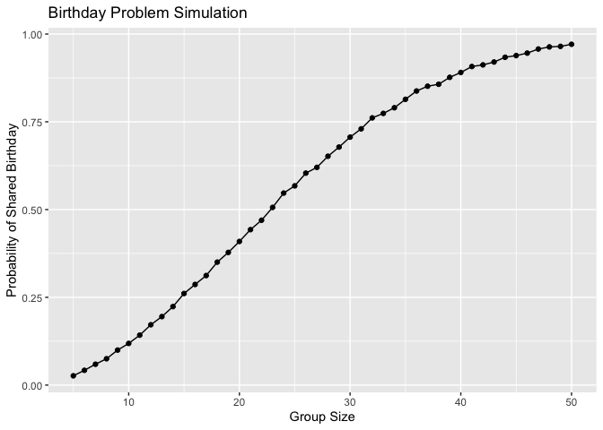
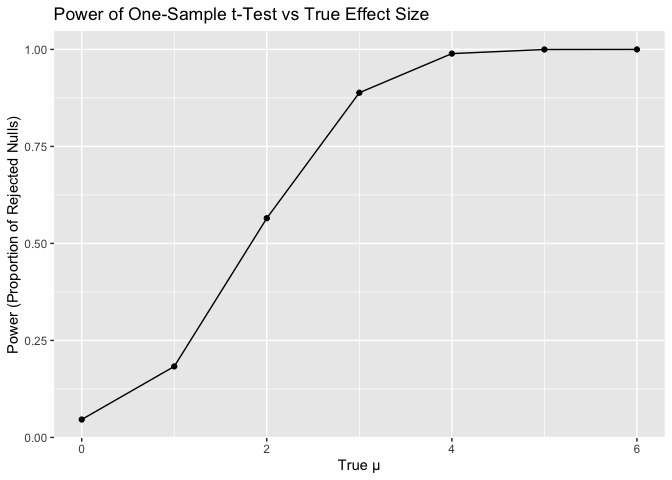
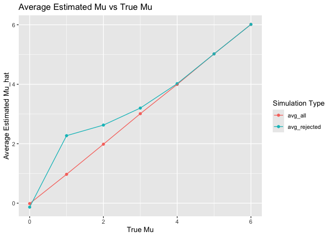
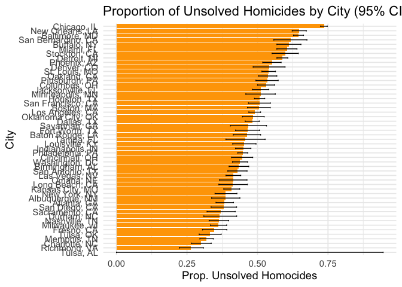

p8105_hw5_KJW2175
================
Kennedy Wade
2025-11-05

# Problem 1

``` r
birthdays = sample(1:365, 5, replace = TRUE)

repeated_bday = length(unique(birthdays)) < 5

repeated_bday
```

    ## [1] FALSE

``` r
bday_sim = function (n_room) {
  
  birthdays = sample(1:365, n_room, replace = TRUE)

repeated_bday = length(unique(birthdays)) < n_room

repeated_bday
  
}

bday_sim(20)
```

    ## [1] TRUE

``` r
bday_sim_results = 
  expand_grid(
    bdays = 5:50,
    iter = 1:12500
  ) |>
  mutate(
    results = map_lgl(bdays, bday_sim)
  ) |>
  group_by(bdays) |>
  summarize(
    prob_repeat = mean(results)
  )
 
bday_sim_results |>
  ggplot(aes(x = bdays, y = prob_repeat)) +
  geom_point() +
  geom_line() +
labs(
    x = "bdays",
    y = "Probability of Shared Birthday",
    title = "Birthday Problem Simulation"
  )
```

<!-- -->

Here, I drew random birthdays for a fixed group size and checked if any
birthdays were duplicated. This code chunk returned a logical value
based on that check. My output of FALSE means that in this random draw,
no one shared a birthday.

This plot shows the probability that at least two people in a group
share the same birthday as the group size increases. When the group is
small (fewer than 10 people), the probability of a shared birthday is
close to zero. As the number of people increases, the probability that
two people share a birthday rises.

# Problem 2

## Defining a function to simulate one dataset and compute the t-test, using a for loop to repeat it 5000 times, and storing results in a list and combining them with bind_rows().

``` r
sim_ttest = function(n = 30, mu = 0, sigma = 5) {
  
  sim_data = tibble(
    x = rnorm(n, mean = mu, sd = sigma)
  )
  
  test_res = t.test(sim_data$x, mu = 0)
  
  tibble(
    mu_hat = mean(sim_data$x),
    p_value = test_res$p.value
  )
}

output = vector("list", 5000)

for (i in 1:5000) {
  output[[i]] = sim_ttest()
}

sim_results = bind_rows(output)
```

## Now, I am looping through each mean value (0–6), running 5000 simulations for each mean, calculating the proportion of p-values \< 0.05, and plotting power vs true mean to see assocation

``` r
mu_values = 0:6      
n_sim = 5000        


sim_grid = expand_grid(
  mu = mu_values,
  iter = 1:n_sim
)

sim_results = sim_grid |> 
  mutate(
    results = map(mu, ~sim_ttest(n = 30, mu = .x, sigma = 5))
  ) |> 
  unnest(results)


power_results = sim_results |> 
  group_by(mu) |> 
  summarize(
    power = mean(p_value < 0.05),
    .groups = "drop"
  )


power_results |> 
  ggplot(aes(x = mu, y = power)) +
  geom_point() +
  geom_line() +
  labs(
    x = "True μ",
    y = "Power (Proportion of Rejected Nulls)",
    title = "Power of One-Sample t-Test vs True Effect Size"
  )
```

<!-- -->

## Making a plot showing the average estimate of 𝜇̂ on the y axis and the true value of 𝜇 on the x axis and overlaying the 2 averages only in samples for which the null was rejected on the y axis and the true value of 𝜇 on the x axis.

``` r
true_means = 0:6
n_sim = 5000

sim_grid = expand_grid(mu = true_means, iter = 1:n_sim)

sim_results = sim_grid |>
  mutate(res = map(mu, ~ sim_ttest(n = 30, mu = .x, sigma = 5))) |>
  unnest(res) |>
  group_by(mu) |>
  summarize(
    avg_all = mean(mu_hat),
    avg_rejected = mean(mu_hat[p_value < 0.05]),
    .groups = "drop"
  ) |>
  pivot_longer(
    cols = c(avg_all, avg_rejected),
    names_to = "type",
    values_to = "avg_mu_hat"
  )

ggplot(sim_results, aes(x = mu, y = avg_mu_hat, color = type)) +
  geom_point() +
  geom_line() +
  labs(
    x = "True Mu",
    y = "Average Estimated Mu_hat",
    title = "Average Estimated Mu vs True Mu",
    color = "Simulation Type"
  )
```

<!-- -->

# Problem 3

## describing the raw dataset

``` r
homicides = read_csv("homicide-data.csv")
```

    ## Rows: 52179 Columns: 12
    ## ── Column specification ────────────────────────────────────────────────────────
    ## Delimiter: ","
    ## chr (9): uid, victim_last, victim_first, victim_race, victim_age, victim_sex...
    ## dbl (3): reported_date, lat, lon
    ## 
    ## ℹ Use `spec()` to retrieve the full column specification for this data.
    ## ℹ Specify the column types or set `show_col_types = FALSE` to quiet this message.

The raw data contains information regarding individual case records with
detailed information about each victim and incident. The dataset
includes variables for unique case IDs, reporting dates, victim
demographics (name, race, age, sex), geographic location (city, state,
latitude/longitude coordinates), and case disposition status. Key
variables for analysis are the disposition categories: “Closed by
arrest” indicates solved cases, while “Closed without arrest” and
“Open/No arrest” represent unsolved homicides.

## Creating a city_state variable, summarizing within cities to obtain the total number of homicides and the number of unsolved homicides (those for which the disposition is “Closed without arrest” or “Open/No arrest”).

``` r
city_homicides <- homicides |>
  mutate(city_state = str_c(city, ", ", state))

city_summary <- homicides |>
  mutate(city_state = str_c(city, ", ", state)) |>
  group_by(city_state) |>
  summarize(
    total_homicides = n(),
    unsolved_homicides = sum(disposition %in% c("Closed without arrest", "Open/No arrest")),
    .groups = "drop"
  )
```

## Baltimore, MD proportion test

``` r
city_homicides |>
  filter(city_state == "Baltimore, MD") |>
  mutate(
    unsolved = ifelse(disposition %in% c("Closed without arrest", "Open/No arrest"), 1, 0)
  ) |>
  summarize(
    unsolved_count = sum(unsolved, na.rm = TRUE),
    total_count = n()
  ) |>
  reframe(
    broom::tidy(prop.test(unsolved_count, total_count))
  ) |>
  select(estimate, conf.low, conf.high)
```

    ## # A tibble: 1 × 3
    ##   estimate conf.low conf.high
    ##      <dbl>    <dbl>     <dbl>
    ## 1    0.646    0.628     0.663

## Running `prop.test` for each city

``` r
get_city_prop_tests <- function(data) {
  data |>
    mutate(
      unsolved = ifelse(disposition %in% c("Closed without arrest", "Open/No arrest"), 1, 0)
    ) |>
    group_by(city_state) |>
    summarize(
      unsolved_count = sum(unsolved, na.rm = TRUE),
      total_count = n(),
      .groups = "drop"
    ) |>
    mutate(
      test = map2(unsolved_count, total_count, ~ prop.test(.x, .y)),
      tidy = map(test, broom::tidy)
    ) |>
    unnest(tidy) |>
    select(city_state, estimate, conf.low, conf.high)
}

city_prop_tests <- get_city_prop_tests(city_homicides)
```

    ## Warning: There was 1 warning in `mutate()`.
    ## ℹ In argument: `test = map2(unsolved_count, total_count, ~prop.test(.x, .y))`.
    ## Caused by warning in `prop.test()`:
    ## ! Chi-squared approximation may be incorrect

``` r
print(city_prop_tests)
```

    ## # A tibble: 51 × 4
    ##    city_state      estimate conf.low conf.high
    ##    <chr>              <dbl>    <dbl>     <dbl>
    ##  1 Albuquerque, NM    0.386    0.337     0.438
    ##  2 Atlanta, GA        0.383    0.353     0.415
    ##  3 Baltimore, MD      0.646    0.628     0.663
    ##  4 Baton Rouge, LA    0.462    0.414     0.511
    ##  5 Birmingham, AL     0.434    0.399     0.469
    ##  6 Boston, MA         0.505    0.465     0.545
    ##  7 Buffalo, NY        0.612    0.569     0.654
    ##  8 Charlotte, NC      0.300    0.266     0.336
    ##  9 Chicago, IL        0.736    0.724     0.747
    ## 10 Cincinnati, OH     0.445    0.408     0.483
    ## # ℹ 41 more rows

## Ploting proportions with 95% CIs

``` r
city_prop_tests |>
  mutate(city_state = reorder(city_state, estimate)
  ) |>
  ggplot(aes(x = city_state, y = estimate)) +
  geom_col(fill = "orange") +
  geom_errorbar(aes(ymin = conf.low, ymax = conf.high), width = 0.3) +
  coord_flip() +
  labs(
    x = "City",
    y = "Prop. Unsolved Homocides",
    title = "Proportion of Unsolved Homicides by City (95% CI)",
  ) +
  theme_minimal(base_size = 14)
```

<!-- -->
