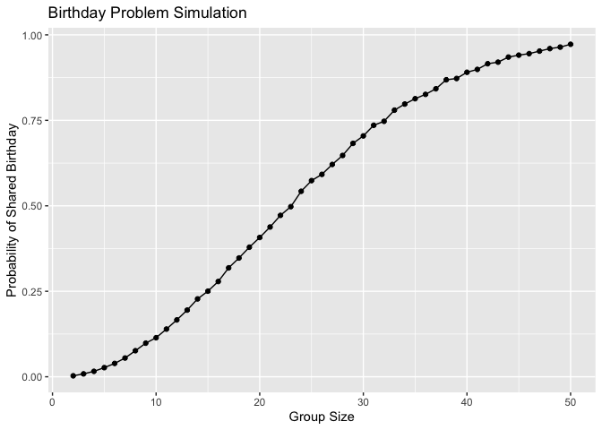
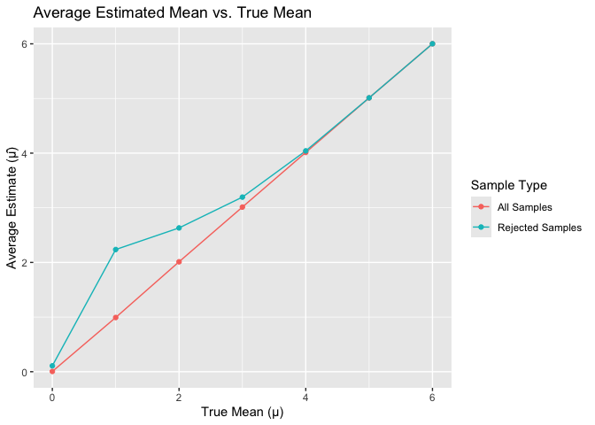

p8105_hw5_KJW2175
================
Kennedy Wade
2025-11-05

# Problem 1

``` r
library(tidyverse)
```

    ## ── Attaching core tidyverse packages ──────────────────────── tidyverse 2.0.0 ──
    ## ✔ dplyr     1.1.4     ✔ readr     2.1.5
    ## ✔ forcats   1.0.0     ✔ stringr   1.5.1
    ## ✔ ggplot2   3.5.2     ✔ tibble    3.3.0
    ## ✔ lubridate 1.9.4     ✔ tidyr     1.3.1
    ## ✔ purrr     1.1.0     
    ## ── Conflicts ────────────────────────────────────────── tidyverse_conflicts() ──
    ## ✖ dplyr::filter() masks stats::filter()
    ## ✖ dplyr::lag()    masks stats::lag()
    ## ℹ Use the conflicted package (<http://conflicted.r-lib.org/>) to force all conflicts to become errors

``` r
library(broom)

set.seed(1)

birthdays = sample(1:365, 5, replace = TRUE)

birthdays
```

    ## [1] 324 167 129 299 270

``` r
length(unique(birthdays)) < 5
```

    ## [1] FALSE

Here, I drew random birthdays for a fixed group size (n = 5) and checked
if any birthdays were duplicated. This code chunk returned a logical
value based on that check. My output of FALSE means that in this random
draw, no one shared a birthday.

``` r
bday_sim = function(n_people) {
  birthdays = sample(1:365, n_people, replace = TRUE)
  length(unique(birthdays)) < n_people
}

group_sizes = 2:50
n_sim = 10000


sim_results = 
  expand_grid(
    group_size = group_sizes,
    iter = 1:n_sim
  ) |> 
  mutate(
    has_duplicate = map_lgl(group_size, bday_sim)
  ) |> 
  group_by(group_size) |> 
  summarize(
    prob_duplicate = mean(has_duplicate),
    .groups = "drop"
  )


sim_results |> 
  ggplot(aes(x = group_size, y = prob_duplicate)) +
  geom_point() +
  geom_line() +
  labs(
    x = "Group Size",
    y = "Probability of Shared Birthday",
    title = "Birthday Problem Simulation"
  )
```

<!-- -->

This plot shows the probability that at least two people in a group
share the same birthday as the group size increases. When the group is
small (fewer than 10 people), the probability of a shared birthday is
close to zero. As the number of people increases, the probability that
two people share a birthday rises.

# Problem 2

``` r
n = 30
sigma = 5
mu_values = 0:6
nsim = 5000
alpha = 0.05

# Step 2: Simulate data and perform t-tests
sim_results = 
  expand_grid(
    mu_true = mu_values,
    iter = 1:nsim
  ) |> 
  mutate(
    data = map(mu_true, ~ rnorm(n, mean = .x, sd = sigma)),
    ttest = map(data, ~ t.test(.x, mu = 0)),
    tidy_test = map(ttest, ~ broom::tidy(.x))
  ) |> 
  unnest(tidy_test) |> 
  select(mu_true, estimate, p.value)

# Step 3: Calculate power (proportion of times null rejected)
power_results = 
  sim_results |> 
  group_by(mu_true) |> 
  summarize(
    power = mean(p.value < alpha),
    .groups = "drop"
  )

# Step 4: Calculate average estimates overall and when null is rejected
avg_estimates = 
  sim_results |> 
  group_by(mu_true) |> 
  summarize(
    mean_estimate_all = mean(estimate),
    mean_estimate_reject = mean(estimate[p.value < alpha]),
    .groups = "drop"
  )

# Step 5: Plot power vs. true mean
power_results |> 
  ggplot(aes(x = mu_true, y = power)) +
  geom_point() +
  geom_line() +
  labs(
    x = "True Mean (μ)",
    y = "Power (Probability of Rejecting H₀)",
    title = "Power vs. Effect Size in One-Sample t-test"
  )
```

<!-- -->

``` r
# Step 6: Plot average estimates
avg_estimates |> 
  ggplot(aes(x = mu_true)) +
  geom_line(aes(y = mean_estimate_all, color = "All Samples")) +
  geom_line(aes(y = mean_estimate_reject, color = "Rejected Samples")) +
  geom_point(aes(y = mean_estimate_all, color = "All Samples")) +
  geom_point(aes(y = mean_estimate_reject, color = "Rejected Samples")) +
  labs(
    x = "True Mean (μ)",
    y = "Average Estimate (μ̂)",
    title = "Average Estimated Mean vs. True Mean",
    color = "Sample Type"
  )
```

<!-- -->
